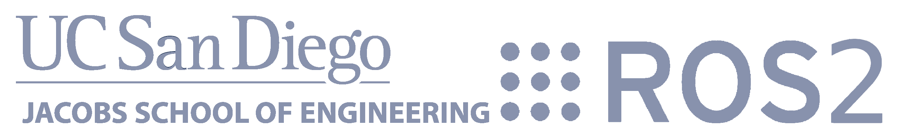
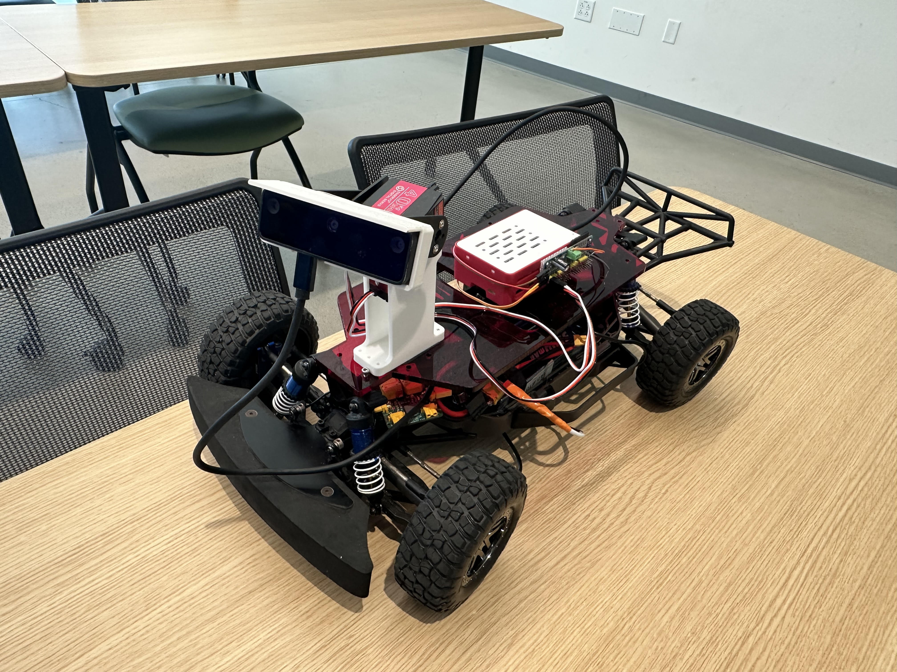
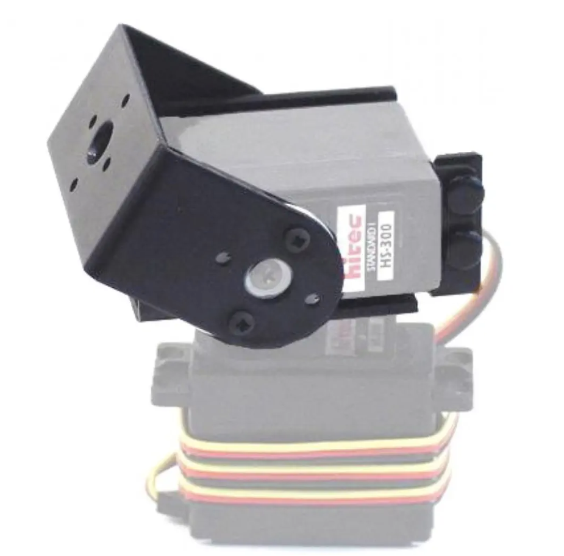
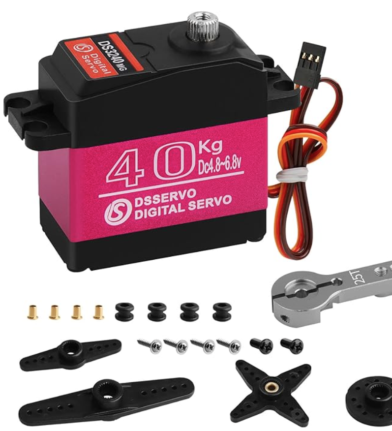
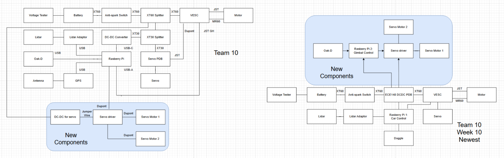

# UCSD ECEMAE148 Team 10 Final Project 

<h1 align="center">OakDLite Gimble Camera & Detection Method Comparisons</h1>
<h4 align="center"></h4>
<!-- PROJECT LOGO -->:
 

<h3>ECE/MAE 148 Final Project</h3>

Team 10 Winter 2025

<!-- TABLE OF CONTENTS -->

  
Table of Contents

  <ol>
    <li><a href="#team-members">Team Members</a></li>
    <li><a href="#final-project">Final Project</a></li>
      <ul>
        <li><a href="#original-goals">Original Goals</a></li>
          <ul>
            <li><a href="#goals-we-met">Goals We Met</a></li>
            <li><a href="#if-we-have-another-week">If We Have Another Week...</a></li>
              <ul>
                <li><a href="#goal-1">Goal 1</a></li>
                <li><a href="#goal-2">Goal 2</a></li>
                <li><a href="#goal-3">Goal 2</a></li>
              </ul>
          </ul>
        <li><a href="#final-project-documentation">Final Project Documentation</a></li>
      </ul>
    <li><a href="#robot-design">Robot Design </a></li>
      <ul>
          <li><a href="#modeled-ourselves">Modeled Ourselves</a></li>
          <li><a href="#open-source-parts">Open Source Parts</a></li>
      </ul>
        <li><a href="#hardware">Hardware</a></li>
      </ul>
    <li><a href="#acknowledgments">Acknowledgments</a></li>
    <li><a href="#authors">Authors</a></li>
    <li><a href="#contact">Contact</a></li>
  </ol>

<!-- TEAM MEMBERS -->
## Team Members

<h4>Team Member Major and Class </h4>
<ul>
  <li>Melvin Y - Mechanical Engineering - Class of 2028</li>
  <li>Youngyen L - Mechanical Engineering - Class of 2026</li>
  <li>Yuxian X - Electrical Engineering - Class of 2026</li>
</ul>

<!-- Final Project -->
## Final Project
<!-- put stuff here -->

<!-- Original Goals -->
### Original Goals
Team 10’s project focuses on the integration of a gimbaled OAK-D Lite to the basic MAE/ECE 148 robot car platform. This would enable a source of vision that is independent of the car’s chassis or direction of travel. Furthermore, we also wanted to compare the computer vision detection options between RGB video w/ depth perception (RGB-D), ArUco Markers/AprilTags, and a combination of these two. We also wish for future trails to test at different lighting levels, as our tests were mainly conducted indoors.

We also wanted to utilize LIDAR for obstacle avoidance and autonomous driving.
   
<!-- End Results -->
### Goals We Met

 We were able to get the gimbal working, as well as having the camera and gimbal communicate with each other, and tracking the AprilTags. We were also able to test between RGB video and AprilTags and were able to compare their Mean Absolute Error, Root Mean Squared Error, and Jitter.

<pre>
Here are our final results of testing, using 100 data points at 50 cm:
  AprilTag:
    MAE (Accuracy Error): 4.66 cm
    RMSE (Stability): 5.37 cm
    Jitter (Noise): 5.34 cm
  RGB-Depth:
    MAE (Accuracy Error): 6.05 cm
    RMSE (Stability): 6.18 cm
    Jitter (Noise): 1.11 cm

Overall, the AprilTags were better at accurately gauging the depth, but had significantly more jitter than the RGB_Depth.
</pre>

  Note: The setup for the scripts is simple, so if you are a future team needing your camera to constantly track and look at objects, consider using our setup, as we were able to condense everything into two scripts. (maybe you need a turret, a harpoon gun, etc)

### If We Have Another Week...
#### Goal 1
Unfortunately, we were not able to test our OakD Lite by using a combination of RGB and AprilTags, so the next logical step would be to do this. And more data points, as well as varying the distances that were being tested, instead of just at 50 cm, would have given us even more data to compare the two with. 
#### Goal 2
Due to the sheer amount of hardware setbacks our team faced, we were not able to get around to using a LIDAR for obstacle avoidance, and that would be a nice upgrade to our robocar
#### Goal 3
The camera delay is noticeable, so testing what caused this delay would also benefit us.

## Final Project Documentation

<!-- Early Quarter -->
### Robot Design

#### Modeled Ourselves
| Part | CAD Model |
|------|--------|
| Servo Mount | <a href="ServoMount.stl"> ServoMount.stl |
| BasePlate | <a href="BasePlateMount.stl"> BasePlateMount.stl |

#### Open Source Parts
| Part | CAD Model | Source |
|------|--------|-----------|
| Gimbal |  | [RobotShop](https://www.robotshop.com/products/lynxmotion-pan-and-tilt-kit-aluminium?pr_prod_strat=e5_desc&pr_rec_id=165fcfb55&pr_rec_pid=7487360368801&pr_ref_pid=7487361974433&pr_seq=uniform)|
| Servo |  | [Amazon](https://www.amazon.com/Digital-Waterproof-Compatible-Crawler-Control/dp/B0C6LVX73M?th=1) |

### Software
<a href="master_vision_node.py"> master_vision_node.py

<a href="gimbal_controller_v3.py"> gimbal_controller_v3.py

Our car ran the default DonkeyCar with a joystick dongle for movement

### Hardware
Below is our wiring schematic:

### How to Run
Copy the two scripts above onto the pi
<pre>
scp "C:\path\to\master_vision_node.py" pi10@ucsdrobocar-148-10.local:~/
</pre>
  
SSH into pi

<pre>
ssh -Y pi10@ucsdrobocar-148-10.local
</pre>
Copy file from pi to Docker container
<pre>
docker cp ~/master_vision_node.py Docker_Container:/home/projects/
</pre>

Enter DockerHub

<pre>
docker start MY_CONTAINER_NAME
docker exec -it MY_CONTAINER_NAME bash
</pre>

Run the two scripts in two terminals using the python3 command
<pre>
On Terminal 1:
python3 master_vision_node.py

On Terminal 2:
python3 gimbal_controller_v3.py
</pre>

<!-- Authors -->
## Authors

Melvin Yu, Yushan X, Youngyen L

<!-- ACKNOWLEDGMENTS -->
## Acknowledgments

*Big thanks to Professor Jack Silberman, our TA Jose and Winston Chou, and thank you Jose and Winston for the ReadMe Templates!

<!-- CONTACT -->
## Contact

* Melvin Yu | mey009@ucsd.edu
* Yushan X | y1xian@ucsd.edu@ucsd.edu 
* Youngyen L | yol064@ucsd.edu@ucsd.edu
